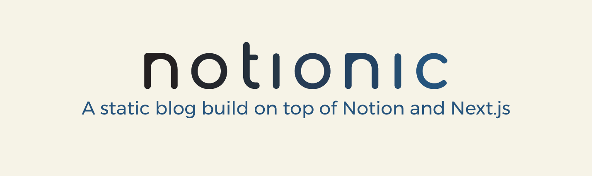

# Notionic

Notionic is a static blog that updates in real time, synchronizing changes to Notion pages without rebuilding the deployment.



## Demo

- Notionic: [https://notionic.vercel.app](https://notionic.vercel.app)
- My Blog: [https://zuolan.me](https://zuolan.me)

## Features

- Incremental static regeneration
- Outline
- Theme switch
- Multi-language
- Native style comments
- Loading and transition animation
- Block page support
- SEO and Open Graph optimization
- Newsletter support
- Contact Form
- Telegram bot integration

## Quick Start

- Duplicate [Notionic template](https://izuolan.notion.site/87d5fa7c98e04cb79ef55f60989dc765), and share it to the public
- [Fork](https://github.com/izuolan/notionic/fork) this project
- **Customize `blog.config.js` file**
- _(Optional)_ Replace `favicon.svg/png/ico` in `public` folder with your own
- Modify `lib/lang.js` with your self introduction
- Deploy on [Vercel](https://vercel.com), set following environment variables：
  - `NOTION_PAGE_ID` (Required): The ID of the Notion page you previously shared to the web, usually has 32 digits after your workspace address
  - eg: `https://your-username.notion.site/<NOTION_PAGE_ID>?v=<view_id>`

More details about Notionic deployment:

- [English](https://zuolan.me/en/notionic_en)
- [中文](https://zuolan.me/notionic)

## Development

```bash
# Init
pnpm install
# Develop
./dev.sh
# Build & Serve
pnpm build
pnpm start
```

## Reference & License

- [Notion-X](https://github.com/NotionX/react-notion-x)
- [Nobelium](https://github.com/craigary/nobelium)
- [NotionNext](https://github.com/tangly1024/NotionNext)

The MIT License.
